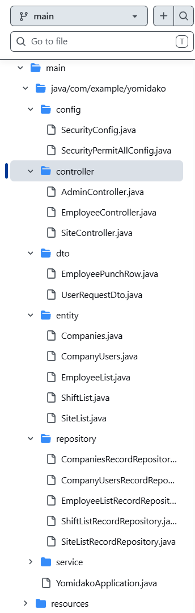
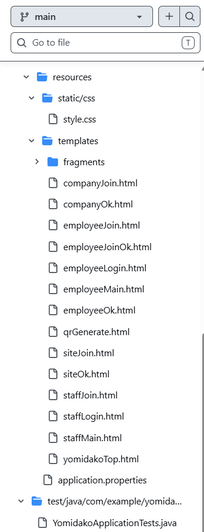

# 「よみだこ」プロトタイプ資料

「よみだこ」のプロトタイプは、2026年2月に職業訓練校の最終課題として1か月で制作されました。<br>
本ページでは、今後の課題を交えて、プロトタイプの内容を一部公開します。

## 概要

独学1週間でSpring bootをキャッチアップし、実際にサーバーにデプロイして動かせる状態になりました。しかしながら設計を怠り、現状は保守性が高いとは言えない状態です。<br>
製品版として開発を進める際には、可読性の高いコードが書けるよう心掛けるとともに、どこに何があるのかが見てすぐにわかるファイル構成にするのが目標です。

## 職業訓練校で作成した資料

Googleドライブを使用してPDFファイルを共有しています。<br>
発表資料に制作の背景や画面サンプルを載せていますので、まずは発表資料(全15スライド)をご覧いただきたく思います。

- [発表資料](https://drive.google.com/file/d/1MsObyDyYQkyYGAZaUDReJ1-UWf22-yuS/view?usp=drive_link)
- [システム概要](https://drive.google.com/file/d/1zWHFdbrcblfETcflEr7PEmiDySKP97ul/view?usp=drive_link)

## ファイル構成

プロトタイプ制作時、動くものを作ることに集中するあまり、画像のようにあまり深く考えずにファイルを作成していました。<br>
画面一覧などの設計を行っていなかったため、後からファイルが増えていき、「一目でどこに何があるのかがわかる」とは言えないファイル構成になってしまいました。
<div align="center" style="display:inline-block;">
    
    
</div>

## コードスニペット

### QRコード関連Service

QRコードの作成や、QRコードが有効かどうかの判定を行う処理を記述しています。

```java
@Service
public class qrService {
    private final SiteListRecordRepository siteListR;
    private static final String SECRET = "CHANGE_ME";

    public qrService(SiteListRecordRepository siteListR) {
        this.siteListR = siteListR;
    }

    /* 従業員token */
    public boolean tokenIsValid(long siteId, String token) {
        String expected = siteListR.findById(siteId).map(s -> s.getToken()).orElse("NO_SITE");
        return expected.equals(token);
    }

    /* 事業所一覧表示用 */
    public List<SiteList> getSites(long companyId){
         return siteListR.findByCompanyIdOrderByIdAsc(companyId);
    }

    /* QR用URL作成 */
    public String makeQrUrl(long siteId, long companyId,
                            String scheme, String serverName, int serverPort){
        SiteList site = siteListR.findById(siteId)
                .orElseThrow(() -> new IllegalArgumentException("Site not found"));

        // 会社が一致するかチェック（不一致なら弾く）
        if (site.getCompanyId() != companyId) {
            throw new IllegalArgumentException("Site does not belong to this company");
        }

        // token save
        String token = UUID.randomUUID().toString();
        site.setToken(token);
        site.setTokenUpdateTime(LocalDateTime.now());
        siteListR.save(site);

        // make URL
        String baseUrl = scheme + "://" + serverName + ":" + serverPort;
        String payload = baseUrl + "/employeeEntry"
                + "?siteId=" + siteId
                + "&token=" + URLEncoder.encode(token, StandardCharsets.UTF_8);

        return "/qr.png?payload=" + URLEncoder.encode(payload, StandardCharsets.UTF_8);
    }
}

```

### ControllerでのService呼び出し例

Controllerでの呼び出し例です。<br>
制作当時は、DI(依存性の注入)を使う方が結合度が下がってテストをしやすくなるということに気付かず、staticで呼び出すように`qrService.getSites(companyId)`と記述してしまっていました。<br>
これを含めた課題点を改善することが、今回の制作における大きな目標のひとつです。

```java

@GetMapping("/qr")
    public String qrGenerate(@RequestParam(value = "siteId", required = false) Long siteId,
                             HttpServletRequest req, HttpSession session, Model model) {
        Object v = session.getAttribute("companyId");
        if (v == null) return "redirect:/staffLogin?error=session";

        long companyId = (v instanceof Long) ? (Long) v : Long.parseLong(v.toString());
        model.addAttribute("sites", qrService.getSites(companyId));

        // 戻り値：String　引数：companyIdとsiteIdのURL生成処理
        String qrUrl = qrService.makeQrUrl(siteId, companyId,
                req.getScheme(), req.getServerName(), req.getServerPort());
        model.addAttribute("qrUrl", qrUrl);

        return "qrGenerate";
    }
```

## 最後に

プロトタイプ制作開始から、**現場の課題の解決を見据えて開発を進めた**ため、実装する機能に迷うことなく開発を進めることができました。<br>
一方で、**設計が不十分**、**Springの特性を活かせていない**、といった課題点がありますので、これを解決して、よりよい開発を目指してまいります。