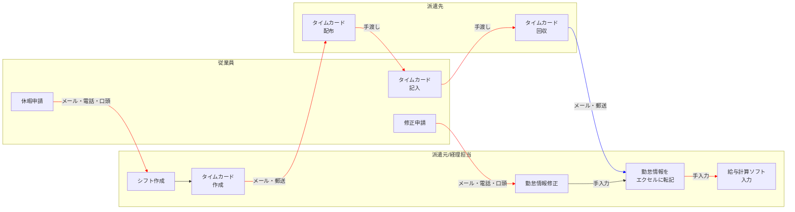
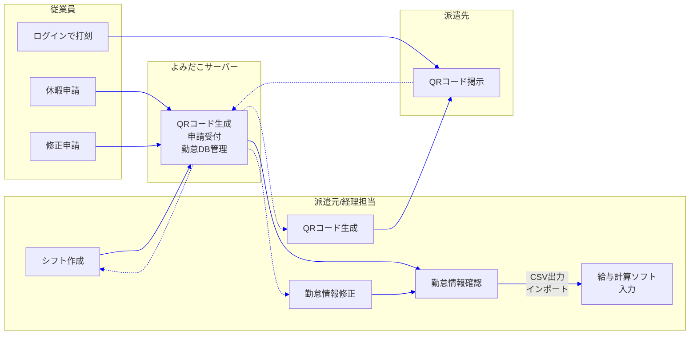
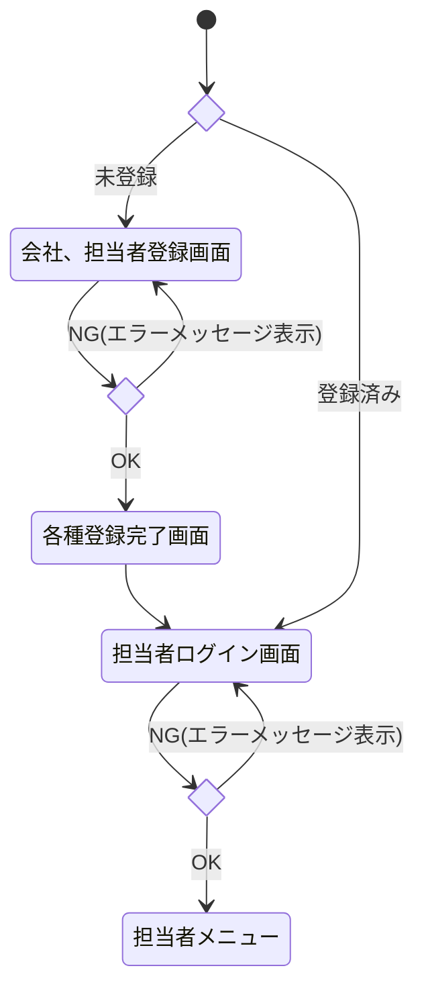
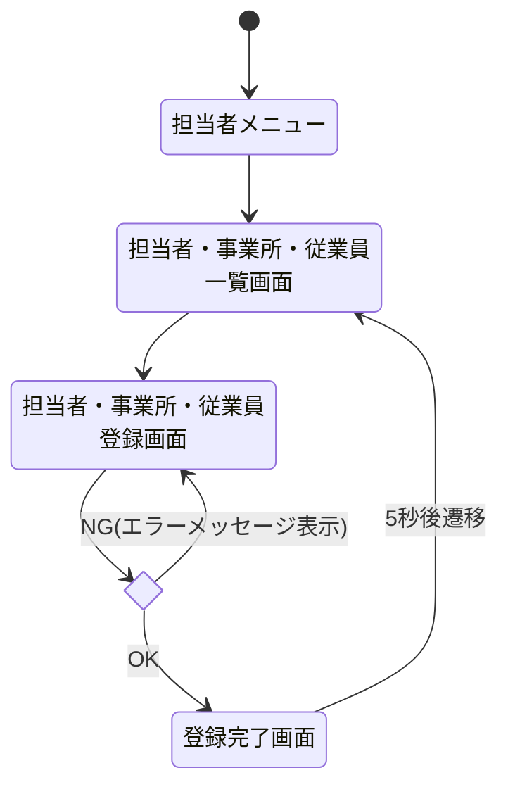
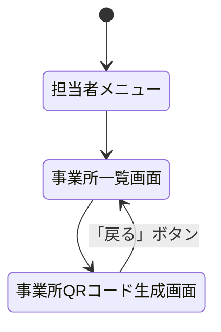
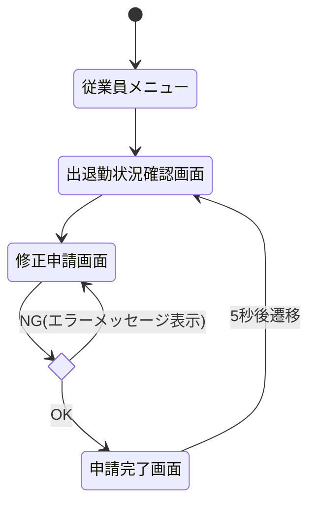
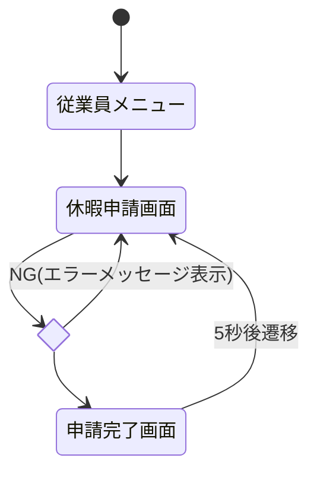
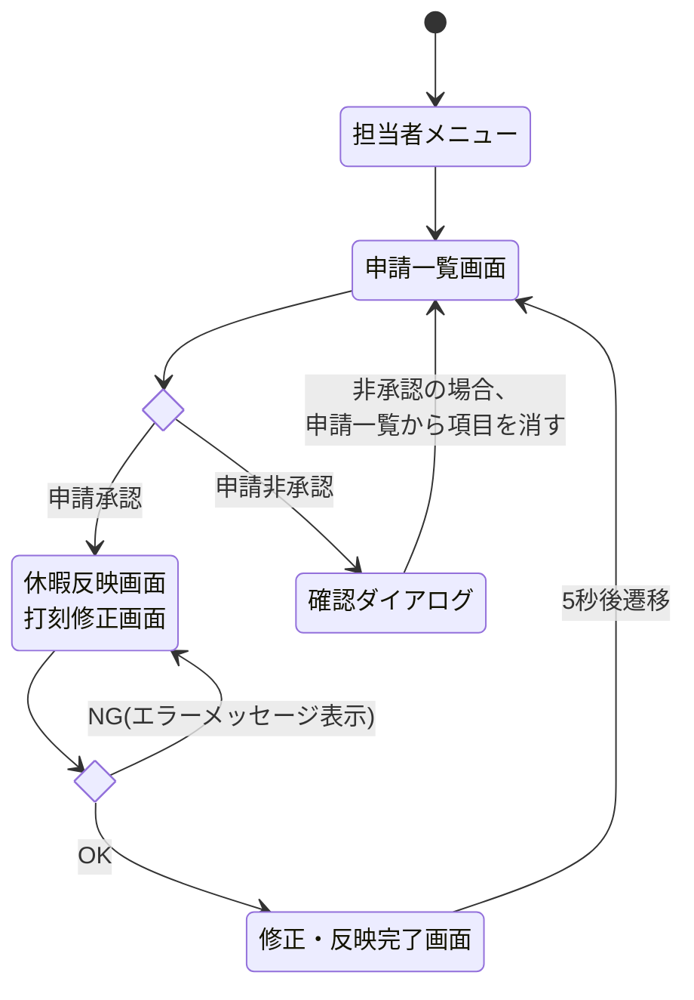
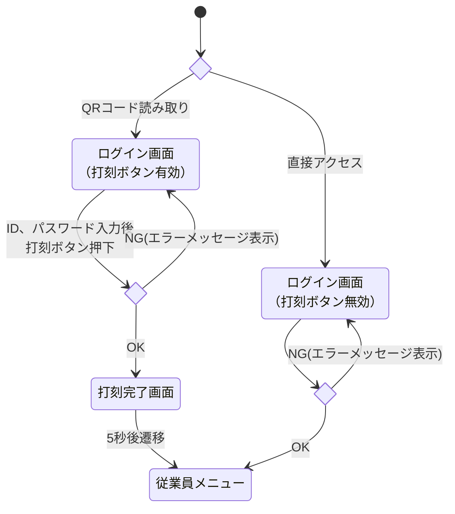

# 「よみだこ」要件定義

<!-- omit in toc-->
## 目次
- [「よみだこ」要件定義](#よみだこ要件定義)
  - [目次](#目次)
  - [要求定義](#要求定義)
    - [課題1：出退勤の管理を紙で行っており、打刻も管理も手間がかかる](#課題1出退勤の管理を紙で行っており打刻も管理も手間がかかる)
    - [課題2：プライバシーへの懸念や、個人情報漏洩リスクが導入の障壁になる](#課題2プライバシーへの懸念や個人情報漏洩リスクが導入の障壁になる)
    - [課題3：工場の奥まった場所など、不安定な通信環境では打刻できない可能性がある](#課題3工場の奥まった場所など不安定な通信環境では打刻できない可能性がある)
    - [課題4：画面操作に不慣れな従業員も使用する](#課題4画面操作に不慣れな従業員も使用する)
    - [課題5：QRコードのコピーなどで、事業所以外の場所で不正に打刻される可能性がある](#課題5qrコードのコピーなどで事業所以外の場所で不正に打刻される可能性がある)
    - [課題6：打刻データが給与管理等のソフトと互換性がなければ、管理者の負担は減らない](#課題6打刻データが給与管理等のソフトと互換性がなければ管理者の負担は減らない)
    - [課題7：不要な機能や複雑な料金形態では導入に至らない](#課題7不要な機能や複雑な料金形態では導入に至らない)
    - [課題8：打刻時の操作ミスなどで不正な打刻データが保存される可能性がある](#課題8打刻時の操作ミスなどで不正な打刻データが保存される可能性がある)
    - [課題9：従業員は休暇の申請を行う時がある](#課題9従業員は休暇の申請を行う時がある)
  - [As-is業務フロー](#as-is業務フロー)
  - [To-be業務フロー](#to-be業務フロー)
  - [業務要件](#業務要件)
  - [機能要件](#機能要件)
  - [画面一覧](#画面一覧)
    - [共通](#共通)
    - [担当者画面](#担当者画面)
    - [従業員画面](#従業員画面)
    - [画面遷移図](#画面遷移図)
      - [担当者ログイン](#担当者ログイン)
      - [登録](#登録)
      - [事業所QRコード生成](#事業所qrコード生成)
      - [申請(従業員側)](#申請従業員側)
        - [打刻修正](#打刻修正)
        - [休暇申請](#休暇申請)
      - [申請(担当者側)](#申請担当者側)
      - [従業員打刻・ログイン](#従業員打刻ログイン)
  - [非機能要件](#非機能要件)
    - [可用性](#可用性)
    - [セキュリティ](#セキュリティ)
    - [パフォーマンス](#パフォーマンス)
    - [保守性](#保守性)
    - [拡張性](#拡張性)

## 要求定義

### 課題1：出退勤の管理を紙で行っており、打刻も管理も手間がかかる
対応方針|要求
----|----
勤怠管理を簡素化する|2ステップ程度で打刻が完了する方式 手入力不要の勤怠管理を実現する

### 課題2：プライバシーへの懸念や、個人情報漏洩リスクが導入の障壁になる
対応方針|要求
----|----
個人情報の収集を最小限に留め、 端末内に情報を残さないセキュアな設計の徹底|氏名や住所をアプリ内に留めず、ID管理する仕組み 外部から通信内容を覗けないようにする

### 課題3：工場の奥まった場所など、不安定な通信環境では打刻できない可能性がある
対応方針|要求
----|----
オフライン・不安定な通信環境下での動作保証とデータ整合性の維持|オフライン時に端末にデータを一時保存、復帰時に自動同期する仕組み

### 課題4：画面操作に不慣れな従業員も使用する
対応方針|要求
----|----
迷わせないユーザ体験 最小アクションでの打刻完了|かざして、もしくは読み取ってログインするだけで打刻が完了する方式

### 課題5：QRコードのコピーなどで、事業所以外の場所で不正に打刻される可能性がある
対応方針|要求
----|----
打刻場所の正当性を担保|打刻時間のGPS位置情報取得し、現場の座標と照合
多重的な認証ロジックの導入|直接URLを打ち込んだらエラー画面を表示させるようにする

### 課題6：打刻データが給与管理等のソフトと互換性がなければ、管理者の負担は減らない
対応方針|要求
----|----
データ流通のシームレス化による、管理部門の転記作業ゼロ化|外部ソフトにインポートするためのCSV出力機能を実装 データのフォーマットを可変式にし、多くの外部ソフトに対応可能にする

### 課題7：不要な機能や複雑な料金形態では導入に至らない
対応方針|要求
----|----
必要最低限の機能実装|打刻、シフト作成、給与計算ソフトとの連携の3機能に絞って実装する
簡潔な料金形態の実現|初期費用を一度だけ請求し、以降は任意のサポート料金を月額で請求する

### 課題8：打刻時の操作ミスなどで不正な打刻データが保存される可能性がある
対応方針|要求
----|----
入力の段階でミスしないような仕組みを作る|フロントサイドで不正な入力値を弾く
データの確認・修正を簡単に行えるようにする|メニューにデータ確認・修正画面を作る

### 課題9：従業員は休暇の申請を行う時がある
対応方針|要求
----|----
打刻時と同じくらい簡単に休暇申請できるようにする|専用ページを設けて簡単にアクセスできるようにする 入力する情報は最低限にし、項目を選択する方式をとる 申請と申請状況の確認を同時にできるようにする

## As-is業務フロー

→：手作業 
→：システム処理

## To-be業務フロー

→：システム処理

## 業務要件

業務区分/対象者|業務要件
----|----
QRコード送付 (経理担当)|データで完結し、郵送を使わずに送付できる
全従業員が 打刻できるようにする (派遣先)|派遣元が発行した打刻用QRコードを掲示する
出退勤打刻 (従業員)|少ない作業で打刻する
締め日の勤怠管理 (経理担当)|転記等の手作業をなくす
給与計算ソフトへの インポート (経理担当)|CSVを既存の給与計算ソフトに連携できる形に加工する
打刻データの確認 (経理担当)|打刻データを一目でわかるデータにする
打刻データの修正 (経理担当)|誰が担当になっても簡単に修正できる 誰が修正したのかログを残す
休暇の申請 (従業員)|担当者とのやり取りを最低限に抑え、時間的・人的コストを削減する

## 機能要件

機能区分|画面|機能要件
----|----|----
データで完結し、郵送を使わずに送付できる|担当者メニュー 事業所QR生成画面|生成したQRコードを簡単に保存できること
派遣元が発行した打刻用QRコードを掲示する|QRコードのデータ|印刷or表示させるだけで完結させること
少ない作業で打刻する|従業員メニュー 打刻画面|従業員メニューへのログインと同時に打刻できること
転記等の手作業をなくす|担当者メニュー |勤怠データを保存したDBからCSV出力する
CSVを既存の給与計算ソフトに連携できる形にする|担当者メニュー CSV出力画面|既存の給与計算ソフトのフォーマットを管理するマスタを参照すること
打刻データを一目でわかるデータにする|担当者メニュー 従業員メニュー 打刻データ画面|打刻データをページ内カレンダーに表示させ、月別に表示すること
誰が担当になっても簡単に修正できること|担当者メニュー 打刻情報修正画面|修正する箇所だけ編集できるようにする 修正すべきでない箇所は触れないようにする
誰が修正したのかログを残す|担当者メニュー 打刻情報確認画面|変更した打刻情報に担当者の名前を表示させるカラムを追加する
担当者とのやり取りを最低限に抑え、時間的・人的コストを削減する|従業員メニュー 各種申請画面|申請の受理・反映を通知する 各種申請のステータスが見られるようにする

## 画面一覧

### 共通

画面名|説明
----|----
各種登録完了画面|登録、打刻が完了したことを知らせる画面
エラー画面|不正なアクセスに表示させる画面

### 担当者画面

画面名|説明
----|----
会社、担当者登録画面|初回の登録画面
担当者ログイン画面|担当者メニューへのログインができる画面
ダッシュボード|出退勤情報やQRコードの最終出力日を簡易的に確認できる画面
管理者メニュー|各種登録画面、事業所一覧、従業員一覧、シフト管理画面へのポータル画面
担当者登録画面|2人目以降の担当者を登録する画面
事業所登録画面|派遣先を登録する画面
従業員登録画面|派遣する従業員を登録する画面
事業所一覧画面|派遣先を登録・表示する画面
従業員一覧画面|従業員の勤怠情報を確認、CSV出力する画面
申請一覧画面|従業員からの申請が表示される画面
事業所QRコード生成画面|打刻用QRコードを生成する画面
休暇反映画面 打刻修正画面|届いた申請を承認後、反映する画面

### 従業員画面

画面名|説明
----|----
従業員ログイン画面|従業員マイページへのログインと打刻ができる画面
ダッシュボード|出退勤情報や当月のシフトを簡易的に確認できる画面
従業員マイページ|自分の出退勤状況確認画面に繋がる画面 当月のシフトと出退勤状況を確認できる 休暇申請画面に繋がる
出退勤状況確認画面|月別にシフトと出退勤状況を確認することができる画面 修正申請画面に繋がる
休暇申請画面|次月以降の休暇申請ができる画面
申請状況確認画面|申請の進捗を確認できる画面

### 画面遷移図

#### 担当者ログイン

初期登録が完了していない場合は、初期登録(会社、担当者登録)をする必要がある。

#### 登録

#### 事業所QRコード生成

「事業所QRコード生成画面」内で「生成」ボタンを押下するとQRコードが生成される。 
「トークン更新日」を指定して「QRコード更新」ボタンを押下すると、トークンを変えたQRコードが生成される。

#### 申請(従業員側)

##### 打刻修正

##### 休暇申請

#### 申請(担当者側)

申請に対して承認/非承認を選択する操作を挟むことで、担当者・従業員の双方が申請状態を確認できるようにし、操作ログを残しやすくする。

#### 従業員打刻・ログイン

事業所QRコードからアクセスした場合のみ、打刻ボタンが使用可。 
直接URLを打ち込んだ場合、打刻ボタンを押せない状態にする。 
従業員メニューログインと共に打刻することで、従業員メニューのダッシュボードで即座に打刻状況の確認ができる。

## 非機能要件

### 可用性

項目|説明
----|----
目標|24時間365日の稼働を目指すが、メンテナンス時は停止を許容
バックアップ|サーバー上のDBのデータを1日1回自動バックアップ

### セキュリティ

項目|説明
----|----
通信|全ての通信をHTTPS化し、外部から見られないようにする
認証|各メニューへのアクセスはID、パスワードによる認証を必須化
不正アクセス対策|認証外のアクセスはエラー画面を表示させる

### パフォーマンス

項目|説明
----|----
応答速度|打刻ボタンを押してから完了画面が出るまで3秒以内を目指す
同時接続|数名～数十名が同時に打刻してもシステムがダウンしない

### 保守性

項目|説明
----|----
ログ|打刻失敗などのエラー時に、原因特定するためのログをサーバー側に記録する
環境構築|Dockerを使用し、サーバー移行をスムーズに行えるようにする

### 拡張性

項目|説明
----|----
法改正への対応|項目の追加及び削除を容易に行えるようにする
設定の外部化|特定の計算ロジックやフォーマットをソースコードに直接書き込まず、設定ファイルやDBの定義値で管理することで、再ビルドなしで調整可能にする
異なる管理ルールへの対応|管理ルールが追加された場合でも既存のデータ構造を壊さず対応できるDB設計を維持する